# Juice for Teams — Codebase Knowledge (Master Document)

**INDEX_VERSION:** 1.0  
**Repo:** `juice-for-teams` (package name) — workspace folder may be named “Juice”; **application code is TypeScript/Next.js, not Python.**  
**Last analyzed:** 2026-04-11  

This document is written for another LLM or engineer with **no repo access**. File paths are **relative to the repository root**.

---

## High-level overview

### What the application is

**Juice for Teams** is a **single marketing landing page** with an embedded **multi-step “subscription workflow” modal** (proof-of-concept). It targets **B2B buyers** (People Ops, HR) considering **recurring ginger juice / shots** as an employee perk. The UI explains value props, demos the signup flow, and optionally **persists lead data to Supabase** (`public.leads`).

### Main features and business purpose

| Feature | Business purpose |
|--------|-------------------|
| **Marketing landing** (`components/landing-page.tsx`) | Educate HR/buyers; anchor CTAs that open the funnel. |
| **4-step + success funnel** (`components/funnel-modal.tsx`) | Capture intent: contact, product mix, cadence, volume; show live estimates. |
| **Delivery calculator** (`lib/funnel-logic.ts` + step 4 UI) | Make abstract “subscription” tangible (shots/bottles per drop and per month). |
| **Lead persistence** (browser Supabase client → `leads` table) | Store submissions for sales/ops follow-up when env + DB are configured. |
| **Supabase session middleware** (`middleware.ts`, `lib/supabase/middleware.ts`) | Standard `@supabase/ssr` pattern: refresh auth cookies on navigation. **No login UI** in this app; effect is mostly preparatory. |

### How features relate (conceptual)

1. **Landing** drives traffic to **one primary action**: open the funnel.  
2. **Funnel** uses **shared pure logic** (`computePlan`) so the **calculator** and **submitted row** stay consistent.  
3. **Submit** either logs to console only (Supabase not configured) or **inserts** one row into **`public.leads`** (when configured).  
4. **Middleware** runs on almost every request to keep **Supabase auth cookies** in sync; the funnel does not depend on logged-in users.

**Decisions / findings:** The product is an **MVP demo**: no dashboard, no payment, no email automation in code.  
**Open questions:** Whether production will add auth, admin views, or server-side lead ingestion.  
**Next steps for implementers:** Confirm privacy policy, rate limiting, and whether anon `INSERT` on `leads` is acceptable long term.

---

## Tech stack

| Layer | Choice | Evidence |
|-------|--------|----------|
| Framework | **Next.js 15** (App Router) | `package.json`, `app/` |
| UI | **React 19** | `package.json` |
| Language | **TypeScript** (strict) | `tsconfig.json` |
| Backend-as-data | **Supabase** (`@supabase/supabase-js`, `@supabase/ssr`) | `lib/supabase/*`, `supabase/schema.sql` |
| Styling | **Global CSS** + CSS variables (no Tailwind) | `app/globals.css` |
| Fonts | **next/font/google** — Fraunces, Source Sans 3 | `app/layout.tsx` |

**Not present:** Python runtime, REST API routes (`app/api` absent), tests, CI config, Docker, ORM migrations (only a manual `schema.sql`).

---

## Directory structure (source-only)

```
app/
  layout.tsx          # Root layout, fonts, metadata
  page.tsx            # Home → <LandingPage />
  globals.css         # All layout + modal + funnel styles
components/
  landing-page.tsx    # Full-page marketing + funnel trigger
  funnel-modal.tsx    # Client modal: steps1–4, submit, success
lib/
  funnel-logic.ts     # Plan math, labels, ingredient metadata
  supabase/
    client.ts         # Browser client + isSupabaseConfigured()
    server.ts         # Server client (cookies) — unused by funnel today
    middleware.ts     # updateSession() for root middleware
middleware.ts         # Next.js middleware entry
supabase/
  schema.sql          # DDL + RLS for public.leads
```

**Build artifacts / deps (ignore for behavior):** `node_modules/`, `.next/`.

---

## System architecture (deep dive)

### Component map

- **Entry:** `app/page.tsx` → `LandingPage`.  
- **Client islands:** `landing-page.tsx` and `funnel-modal.tsx` are `"use client"`.  
- **Server:** `app/layout.tsx` is a Server Component; no data fetching there.  
- **Edge:** `middleware.ts` delegates to `updateSession` which calls `supabase.auth.getUser()` to refresh the session.

### Data flow (user → persistence)

```mermaid
sequenceDiagram
  participant U as User
  participant LP as LandingPage
  participant FM as FunnelModal
  participant FL as computePlan
  participant SB as Supabase (browser)
  participant DB as public.leads

  U->>LP: CTA click
  LP->>FM: open modal
  U->>FM: steps 1–4
  FM->>FL: computePlan(...)
  FM->>FM: validate steps
  alt Supabase configured
    FM->>SB: from("leads").insert(row)
    SB->>DB: INSERT
    DB-->>SB: ok / error
    SB-->>FM: result
  else Not configured
    FM->>FM: console.log(row)&#59; success UI
  end
```



**Diagram files (editable):** `codebase-analysis-docs/assets/architecture.mmd`, `codebase-analysis-docs/assets/schema-er.mmd`.

### Third-party integrations

- **Supabase Auth + DB:** URL and anon/publishable key from **public** env vars (`NEXT_PUBLIC_SUPABASE_*`).  
- **Google Fonts** via Next.js font optimization.

### Cross-cutting concerns

| Concern | Implementation |
|--------|----------------|
| **Auth** | Middleware refreshes session; **no sign-in UI** or protected routes in this codebase. |
| **Security** | RLS on `leads`: **anon can INSERT only** (`with check (true)`), no SELECT for anon. Keys are **exposed to the browser** by design (anon key). |
| **Logging** | `console.log` on submit; `console.error` on Supabase failure. |
| **Caching** | None explicit; static marketing page. |
| **Accessibility** | Skip link, `aria` on modal progress, focus management on step 1 email. |

### Architectural patterns

- **App Router** with minimal server surface.  
- **Supabase SSR cookie pattern** (`createServerClient` in middleware and `lib/supabase/server.ts`).  
- **Pure domain logic** isolated in `lib/funnel-logic.ts` (easy to unit test later).  
- **Optional integration:** `isSupabaseConfigured()` gates DB writes.

**Decisions / findings:** `lib/supabase/server.ts` is set up for Server Components/API routes but **no caller** exists yet for leads.  
**Open questions:** Whether to move inserts to a **server action** or API route to hide operations behind validation.  
**Next steps:** If adding auth, align middleware + RLS policies with real user roles.

---

## Feature-by-feature analysis

### F1 — Marketing landing page

- **Purpose:** Position “Juice for Teams” for HR; explain workflow vs. episodic perks.  
- **Entry:** `/` → `app/page.tsx` → `LandingPage`.  
- **Technical:** Single client component with local `funnelOpen` state; multiple buttons set `setFunnelOpen(true)`. Anchor links (`#how-it-works`, etc.) rely on `scroll-behavior: smooth` in `globals.css`.  
- **Interactions:** Only opens `FunnelModal`; no API.  
- **Edge cases:** Logo uses `href="#"` (scroll to top behavior only).

### F2 — Multi-step funnel modal

- **Purpose:** Collect **email, company, role**, **ingredient mix**, **frequency**, **team size**, **quantity tier**; show success recap.  
- **Entry:** `FunnelModal` from `LandingPage`.  
- **State machine:** `step` is `1 | 2 | 3 | 4 | "success"`; `MAX_STEP = 4`.  
- **Validation:** HTML5 email validity + custom company check; `window.alert` for steps 2–4 omissions (`validateStep`).  
- **UX:** Escape closes; backdrop closes; `body.modal-open` locks scroll; focus on email when opening step 1.  
- **Submit (`handleSubmit`):** Builds `row` object; logs `console.log("Juice for Teams — subscription POC:", row)`; if `isSupabaseConfigured()`, `insert` into `leads`.  
- **Success:** Always moves to `"success"` when submit succeeds **without** Supabase error; `savedToSupabase` distinguishes null (not attempted) / true / false for messaging.  
- **Interactions:** Imports `computePlan`, constants from `lib/funnel-logic.ts`; `createClient` from `lib/supabase/client.ts`.  
- **Hidden dependencies:** DB must match columns in `supabase/schema.sql`; error message tells user to run schema in SQL editor.

### F3 — Plan / calculator (`lib/funnel-logic.ts`)

- **Purpose:** Derive **shots/bottles per drop** and **per month** from ingredients, tier multiplier, team size, frequency.  
- **Rules (hardcoded):**  
  - Each ingredient maps to shot and/or bottle counts per person via `INGREDIENT_META`.  
  - `TIER_MULT`: light `0.85`, standard `1`, generous `1.45`.  
  - `FREQ_DELIVERIES_PER_MONTH`: weekly `52/12`, biweekly `26/12`, monthly `1`.  
- **Formula:** Per drop: `round(team * perPerson * tierMult)` for shots and bottles separately; per month: `round(perDrop * deliveriesPerMonth)`.  
- **Interactions:** Used only by `FunnelModal` for display + insert payload.

### F4 — Supabase: browser client (`lib/supabase/client.ts`)

- **`createClient()`:** `createBrowserClient(url, anonKey)`.  
- **`isSupabaseConfigured()`:** Both `NEXT_PUBLIC_SUPABASE_URL` and anon/publishable key must be non-empty.  
- **Key resolution:** `NEXT_PUBLIC_SUPABASE_ANON_KEY` or `NEXT_PUBLIC_SUPABASE_PUBLISHABLE_KEY`.

### F5 — Supabase: middleware session refresh

- **`lib/supabase/middleware.ts` — `updateSession`:** Creates a server client bound to request/response cookies; `await supabase.auth.getUser()`; returns `NextResponse.next` with cookies applied.  
- **`middleware.ts`:** Matcher excludes static assets and image extensions.  
- **Interactions:** Every matched request pays one auth refresh call (lightweight if no session).

### F6 — Database schema & RLS (`supabase/schema.sql`)

- **Table `public.leads`:** Columns align with `row` in `funnel-modal.tsx` (`quantity_tier`, `team_size`, computed int fields, `ingredients text[]`, etc.).  
- **RLS:** Enabled; policy **`leads_insert_anon`** allows **`INSERT` for `anon`** with **`with check (true)`** (any row shape allowed by table constraints).  
- **Grants:** `anon` may `INSERT` only (no SELECT/UPDATE/DELETE).

**Cross-feature map:** `LandingPage` → `FunnelModal` → `computePlan` + optional `insert(leads)`. Middleware is orthogonal (session refresh).

**Decisions / findings:** Success screen shows a **hint** when Supabase was not used (`savedToSupabase !== true` includes both `null` and unconfigured paths — actually when not configured, `didSave` stays `null`, and success still shows; the recap lists env instructions when `savedToSupabase !== true`, which includes `null` i.e. not saved to cloud).  
**Open questions:** Product copy promises “saved” even when only console logging — clarify for production.  
**Next steps:** Add server-side validation and spam protection before public launch.

---

## Nuances, subtleties, and gotchas

### Things you must know before changing code

1. **Anon INSERT is wide open:** Any client with the anon key can insert arbitrary rows into `leads` (subject to column types). Mitigate with CAPTCHA, rate limits, Edge Functions, or server-side proxy.  
2. **Secrets in repo risk:** A file `password supabase.txt` exists at repo root (not analyzed here). **Rotate credentials** if this was ever committed or shared; prefer env-only secrets.  
3. **`NEXT_PUBLIC_*` keys are public:** Standard for Supabase anon key but means **RLS is the security boundary**.  
4. **Tier default in plan:** `computePlan` uses `quantityTier || "standard"` in the modal when computing `plan`; step 4 still requires explicit tier before continue — consistent for submit.  
5. **`noValidate` on form:** Native validation bypassed on form; email validity checked manually via ref in step 1.  
6. **`quantityTier` state vs. `plan.tier`:** Submit uses `plan.tier` from `computePlan(..., quantityTier || "standard", ...)` — if somehow tier were empty at submit, tier would still be `"standard"` in payload.  
7. **Frequency null guard:** Submit checks `plan.freq` and errors if missing.  
8. **Ingredient keys:** Must stay in sync among `INGREDIENT_OPTIONS` in `funnel-modal.tsx`, `INGREDIENT_META` in `funnel-logic.ts`, and any reporting downstream.  
9. **Server Supabase client unused for leads:** Refactor to server actions would duplicate cookie handling in `lib/supabase/server.ts`.  
10. **No tests:** Changes to `computePlan` can silently break business numbers — add unit tests first.

### Performance

- Small static page; main cost is **middleware** on each navigation and **client bundle** size (React + Supabase). No image CDN or heavy data fetching.

### Security implications (summary)

- **RLS:** Insert-only anon is intentional for POC; **not** suitable for high-trust production without abuse controls.  
- **PII:** Email and company stored in plain text in Supabase.

**Decisions / findings:** The app is a **deliberate MVP** balancing speed vs. hardening.  
**Open questions:** Compliance (GDPR), data retention, and lead export process.  
**Next steps:** Add monitoring for `leads` table growth and failed inserts.

---

## Technical reference and glossary

### Glossary (domain)

| Term | Meaning |
|------|---------|
| **Drop** | One delivery batch to the team. |
| **Shot** | 60ml shot-style SKU (see ingredient options). |
| **Bottle** | 500ml bottle SKU (`apple_juice`). |
| **Cadence / frequency** | `weekly`, `biweekly`, `monthly`. |
| **Quantity tier** | `light`, `standard`, `generous` — scales per-person amounts. |
| **Lead** | One funnel submission row in `public.leads`. |

### Key symbols (files → exports)

| Path | Symbol | Role |
|------|--------|------|
| `middleware.ts` | `middleware` | Invokes `updateSession`. |
| `lib/supabase/middleware.ts` | `updateSession` | Refreshes Supabase auth cookies. |
| `lib/supabase/client.ts` | `createClient`, `isSupabaseConfigured` | Browser Supabase + env check. |
| `lib/supabase/server.ts` | `createClient` | Server Component Supabase (async cookies). |
| `lib/funnel-logic.ts` | `computePlan`, `INGREDIENT_META`, `TIER_MULT`, `FREQ_DELIVERIES_PER_MONTH`, labels | Pure planning math and copy maps. |
| `components/landing-page.tsx` | `LandingPage` | Marketing shell + funnel open state. |
| `components/funnel-modal.tsx` | `FunnelModal` | Wizard UI + submit + Supabase insert. |

### Database schema (authoritative)

Source: `supabase/schema.sql`.

- **`public.leads`:** `id` (uuid, default `gen_random_uuid()`), `created_at`, `email`, `company`, `role` (nullable), `ingredients` (`text[]`), `frequency`, `quantity_tier`, `team_size`, `shots_per_drop`, `bottles_per_drop`, `shots_per_month`, `bottles_per_month`.  
- **RLS:** `leads_insert_anon` FOR INSERT TO `anon` WITH CHECK (true).

**ER diagram:** `codebase-analysis-docs/assets/schema-er.mmd`.

### Environment variables

Documented in `.env.example`:

- `NEXT_PUBLIC_SUPABASE_URL`  
- `NEXT_PUBLIC_SUPABASE_ANON_KEY` (or `NEXT_PUBLIC_SUPABASE_PUBLISHABLE_KEY` per `lib/supabase/*.ts`)

### Internal “API” surface

- **No HTTP API** implemented in Next.js.  
- **Supabase client API used:** `supabase.from("leads").insert(row)` from the browser (`funnel-modal.tsx`).  
- **Example payload shape (insert):** fields in `row` object in `handleSubmit` inside `components/funnel-modal.tsx` (`email`, `company`, `role`, `ingredients`, `frequency`, `quantity_tier`, `team_size`, shot/bottle aggregates).

---

## File index (Pass 0 — prioritization)

**Scoring note:** Entry points and high-coupling modules scored highest; `node_modules`/`.next` omitted.

| # | Priority | Path | Type | Lines | NOTES |
|---|----------|------|------|-------|-------|
| 1 | P0 | `components/funnel-modal.tsx` | UI + integration | 522 | Wizard, validation, Supabase insert |
| 2 | P0 | `lib/funnel-logic.ts` | Domain | 82 | All quantity math |
| 3 | P1 | `components/landing-page.tsx` | UI | 232 | Marketing + CTA wiring |
| 4 | P1 | `app/globals.css` | Styles | 857 | Single stylesheet |
| 5 | P1 | `supabase/schema.sql` | DDL/RLS | 29 | Must match insert payload |
| 6 | P2 | `lib/supabase/client.ts` | Client lib | 18 | Env gating |
| 7 | P2 | `lib/supabase/middleware.ts` | Edge lib | 40 | Session refresh |
| 8 | P2 | `middleware.ts` | Edge entry | 10 | Matcher config |
| 9 | P3 | `app/layout.tsx` | Server UI | 29 | Metadata, fonts |
| 10 | P3 | `app/page.tsx` | Server UI | 4 | Route composition |
| 11 | P3 | `lib/supabase/server.ts` | Server lib | 40 | Reserved for future |
| 12 | P4 | `next.config.ts` | Config | 3 | Empty options |
| 13 | P4 | `package.json` | Manifest | — | Dependencies |
| 14 | P4 | `tsconfig.json` | Config | — | `@/*` paths |

*HASH8 omitted — stable line counts captured on 2026-04-11 from workspace.*

---

## Chunking notes (for large-codebase continuation)

Example chunk IDs if this repo grows:

- `CHUNK_ID = components/funnel-modal.tsx#1-280#…` — state, validation, navigation  
- `CHUNK_ID = components/funnel-modal.tsx#281-560#…` — render, submit, success  

Current repo fits full-file reads; chunking is optional.

---

## Assumptions (with confidence)

| Assumption | Confidence |
|------------|------------|
| Product is POC/MVP for internal or pilot use | High (copy + console log + open anon insert) |
| No production auth flows yet | High (no login UI) |
| `password supabase.txt` may contain sensitive data | Medium (filename only; content not read) |

---

## Appendix A — STATE BLOCK (latest)

```
INDEX_VERSION: 1.0
FILE_MAP_SUMMARY: ~14 first-party TS/TSX/CSS/SQL files; single route /; no app/api; supabase/schema.sql defines leads.
OPEN_QUESTIONS: Production hardening? Move insert server-side? Remove or secure password file in repo root?
KNOWN_RISKS: Open anon INSERT; public anon key; possible credentials file in tree; no automated tests.
GLOSSARY_DELTA: (none beyond main glossary)
```

---

## Appendix B — Continuation protocol

If analysis must resume elsewhere: re-ingest **Appendix A STATE BLOCK**, then prioritize **NEXT_READ_QUEUE**:

1. `components/funnel-modal.tsx` (submit + error paths)  
2. `lib/funnel-logic.ts` (math changes)  
3. `supabase/schema.sql` (RLS migrations)  

**CONTINUE_REQUEST:** Not required — repository fully covered.

---

*End of CODEBASE_KNOWLEDGE.md*
